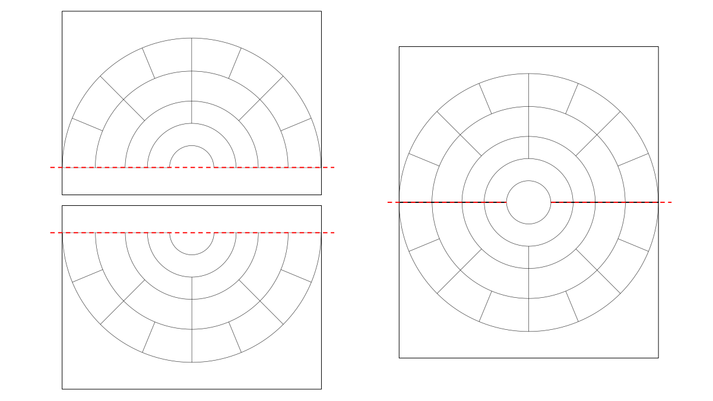
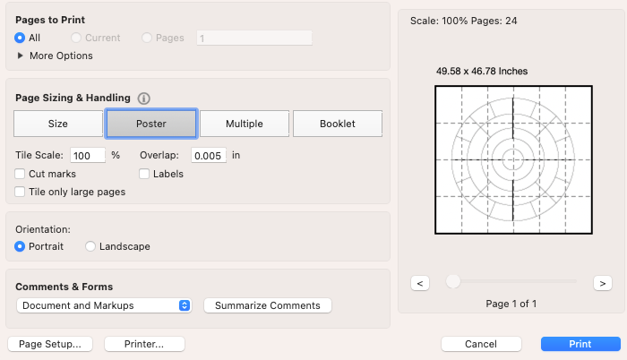

# CircTreeGen

## About

This is a repository for the **CircTreeGen** shiny app ([https://jlnetosci.shinyapps.io/CircTreeGen/](https://jlnetosci.shinyapps.io/CircTreeGen/)).

While free printable templates for circular family trees/fan charts are available throughout the web, their formatting is extremely stiff. **CircTreeGen** was created to provide flexibility when generating these printable templates.

This simple app generates a circular family tree with some customizable options:

-   Number of generations: from 2 to a maximum of 12 (v0.1.1).
-   Display type: full, half, or quarter circle.
-   Export size: a 100×100 cm square, standard sizes A4 (29.7×21 cm) or Letter (27.9×21.6 cm) in landscape.
-   Export format: PDF or SVG.

### Number of Generations

A maximum number of 12 generations was selected to provide a wide range while keeping a sane limit.

### Display type

Half and quarter circle displays were added to offer a deliberate way of printing partial circles in multiple pages:

Printing a half circle in each sheet (and joining them, as displayed above) will roughly double the radius, increasing the writable area. Printing a quarter circle in each sheet will roughly quadruple the radius, greatly increasing the writable area available (this is useful when printing a large number of generations).

### Export size

Standard (A4 and Letter) sheet sizes are available.

Additionally there is an option to export a the circular tree in a larger (100×100 cm) square. If this size is downloaded, default printing preferences should automatically resize them to the sheet size available. The user might select other printing preferences *e.g.* [Adobe Acrobat Reader](https://get.adobe.com/reader/) will provide an option to print "as poster" dividing the file in an appropriate number of sections/sheets as seen below:

This export size gives the user the possibility of printing the template as a full-size high resolution poster, that might be useful when selecting a large number of generations.

(**Note:** While I have printed other large size posters before - and therefore assume this would be no different - I have not yet tried it with these templates, in case you have please let me know)

### Export format

Templates can be saved as easily printable .pdf documents or .svg files which are modifiable using editing software (*e.g.* [Adobe Illustrator](https://www.adobe.com/products/illustrator.html) or [Inkscape](https://inkscape.org/)).

------------------------------------------------------------------------

## 🐳 Dockerfile

A local instance of this app can be run using Docker ([download](https://docs.docker.com/get-docker/), [installation](https://docs.docker.com/engine/install/)).

Usage example:

1.  Pull the image from dockerhub, with `docker pull jlnetosci/circtreegen:v0.1.1`.
2.  Run `docker run -p 3838:3838 jlnetosci/circtreegen:v0.1.1` to start the application.
3.  Open `http://localhost:3838/` in your browser.

The fully functional app should be available in your local machine.
